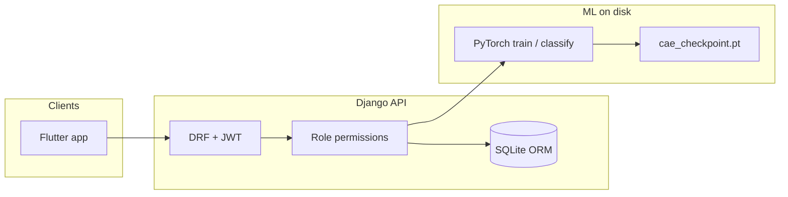

# Cow insurance & muzzle-ID system (PoC)

**One line:** End-to-end proof of concept for livestock insurance: register cattle, run claims with admin → agent → farmer workflows, and identify animals from muzzle photos using learned embeddings.

## What I built

- **Backend API** — Django REST Framework with JWT auth, role-based access (admin, company agent, farmer), and documented REST endpoints for profiles, cow registration (photos + muzzle images), dashboards, and the full insurance claim lifecycle (submit → assign agent → field verification → admin decision).
- **ML pipeline** — PyTorch contrastive convolutional autoencoder on muzzle imagery: per-cow latent embeddings, class centroids, incremental training hooks, batch/single classification scripts, and integration via a Django service that scores new images against stored profiles (top‑k matches, optional distance threshold).
- **Flutter frontend** — Mobile client consuming the same API: authentication, role-appropriate flows, and integration with registration, claims, and identification features (separate from this repository).

## What I achieved

- Delivered a **coherent domain model** (users, cows, policies, claims) with permissions that match real insurance operations instead of a single “demo user” API.
- Showed **practical CV + backend integration**: training artifacts and checkpoints drive live inference from uploaded files in the server environment.
- Produced a **demo-ready stack**: REST + JWT + SQLite (dev), optional training metrics and embedding visualizations for iteration and stakeholder review.

## Architecture

**Layers**

1. **Clients** — Flutter app (or any HTTP client) talks to JSON over HTTPS-capable Django; JWT bearer auth on protected routes.
2. **API surface** — DRF view classes per domain area (auth user info, registration, claims, admin aggregates, ML). OpenAPI is generated by **drf-spectacular** (Swagger UI at `/api/docs/`, ReDoc at `/api/redoc/`).
3. **Authorization** — `User` + `UserProfile.user_type`; custom DRF permission classes (`IsCompanyAgent`, `IsFarmer`, `IsAdminUser`, composites) gate each endpoint so business rules stay out of ad-hoc `if` blocks in views.
4. **Domain & persistence** — Django ORM models for profiles, cows, per-cow **TrainingStatus**, and **InsuranceClaim** with explicit fields for submission, assignment, verification, and final approval.
5. **Media** — Uploaded images under `MEDIA_ROOT` / `cow_images`; served in DEBUG via Django static helper (production would use object storage or a reverse proxy).
6. **ML subsystem** — Standalone PyTorch modules at **project root** (`contrastive_autoencoder.py`, `incremental_train.py`, batch CLI scripts). Django **services** (`classification_service`, `training_service`) extend `sys.path` to that root, load `cae_checkpoint.pt`, and run inference or incremental training without duplicating model code.

**Claim workflow (data model)**

Submit → optional admin **assign** → assigned agent **verify** (boolean + notes) → admin **approve/reject** (final). Status and foreign keys on `InsuranceClaim` make the pipeline queryable and auditable.

**Training vs inference**

Registration can kick off **incremental** training in a **daemon background thread** so the HTTP response returns quickly; clients poll **`GET /api/training-status/<id>/`**. The global checkpoint and `class_means` are updated on disk; classification reads the same artifact for nearest-centroid matching in embedding space.

## Repository structure

| Area | Role |
|------|------|
| `cow_detection_backend/` | Django project package: `settings.py`, root `urls.py`, WSGI. |
| `cow_detection_backend/api/` | App: `models`, `serializers`, `views`, `urls`, `permissions`, `admin`, migrations; **`classification_service.py`** and **`training_service.py`** bridge to ML. |
| `contrastive_autoencoder.py`, `incremental_train.py` | Core CAE architecture, training loop, checkpoint I/O, plots/metrics. |
| `classify_cow.py`, `classify_cow_batch.py` | Offline / ops-friendly classification entrypoints. |
| `training_metrics.json`, `plots/` | Logged runs and embedding visualizations. |
| `SETUP.md`, `cow_detection_backend/API_DOCUMENTATION.md` | Setup and API reference. |
| Flutter repo (separate) | Mobile UI consuming this API. |

## Stack (detail)

| Layer | Choices |
|-------|---------|
| Runtime | Python 3, Django ≥ 4.2 |
| API | Django REST Framework, JSON-only default renderer |
| Auth | `djangorestframework-simplejwt` (access + refresh); custom token serializer adds **`user_type`** (and user id/username) to JWT claims and login JSON for the mobile client |
| Docs | drf-spectacular (OpenAPI 3, Bearer security scheme) |
| Cross-origin | `django-cors-headers` (dev: allow all origins) |
| DB | SQLite file under backend `BASE_DIR` (dev PoC) |
| CV / ML | PyTorch, torchvision, scikit-learn (e.g. t-SNE for plots), Pillow; Matplotlib with **Agg** backend in server code paths |
| Mobile | Flutter (Dart), HTTP client + JWT storage, role-based navigation |
| Optional hardening | `USE_HTTPS` env toggles secure cookies / proxy SSL header in settings |

## Engineering challenges

- **Monolith + ML coexistence** — The web app and training code live in one repo but different import roots. Services deliberately prepend **project root** to `sys.path` so the same `ConvAutoencoder` and checkpoint format are used for CLI training and API inference, avoiding drift between “notebook model” and “production model.”
- **Long-running training inside Django** — Full epoch loops cannot block the request thread. Training runs in a **daemon `threading.Thread`** after cow registration; state is persisted via **`TrainingStatus`** and checkpoint files so the client can poll and the server can recover semantics (pending / running / completed / failed).
- **Headless servers** — Matplotlib must not require a display; **`matplotlib.use('Agg')`** is set before any pyplot import in ML-facing modules.
- **Device diversity** — Classification selects **MPS / CUDA / CPU** when loading the model; incremental training in `training_service` uses **CUDA when available, else CPU** (paths can be aligned if you need MPS for training on Apple Silicon).
- **Role-heavy insurance logic** — Agents register cows and verify only **assigned** claims; farmers see only **their** cows; only admins finalize claims. Encoding that in **DRF permissions** keeps endpoints consistent for the Flutter app and for OpenAPI consumers.
- **PoC vs production gaps** — Global checkpoint + centroid file is simple but implies **single-writer** assumptions; SQLite and permissive CORS are appropriate for demos, not load-balanced or multi-tenant production without migration to a job queue, object storage, and a stricter DB/CORS policy.
